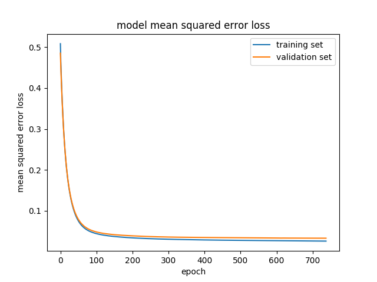

#**Behavioral Cloning Project** 

The goals / steps of this project are the following:
* Use the simulator to collect data of good driving behavior
* Build, a convolution neural network in Keras that predicts steering angles from images
* Train and validate the model with a training and validation set
* Test that the model successfully drives around track one without leaving the road
* Summarize the results with a written report

## Description of the submitted Files.

###1. Submitted files.

My project includes the following files:
* data.py  containing all the code to load training data, preprocess images, and feed the training data into the model through the generator.
* model.py containing the code to build the CNN model using keras framework
* train.py containing the script implementing the training procedure itself
* drive.py for driving the car in autonomous mode
* model.h5 containing a trained convolution neural network
* writeup_report.md summarizing the results
* udacity_only_track1.mp4 recording of the simulation in autonomous mode on track1 using model trained udacity-provided data set
* udacity_only_track2.mp4 recording of the simulation in autonomous mode on track2 using model trained udacity-provided data set
* full_set_track1.mp4 recording of the simulation in autonomous mode on track1 using model re-trained on complete training set
* full_set_track2.mp4 recording of the simulation in autonomous mode on track2 using model re-trained on complete training set

###2. Instructions to test the simulator in autonomous mode.
Using the Udacity provided simulator and my drive.py file, the car can be driven autonomously around the track by executing 
```sh
python drive.py model.h5
```

The drive.py file is almost identical to the original file provided by Udacity, except preprocessing the image
before feeding it into the model for prediction.

###3. Submission code is usable and readable

The train.py file contains the code for training and saving the convolution neural network. The file shows the pipeline I used for training and validating the model, and it contains comments to explain how the code works.

The data.py contains the code to load training data and preprocess images before feeding into the
CNN. The preprocessing includes:
1. Applying [GaussianBlur](https://en.wikipedia.org/wiki/Gaussian_blur) to smooth the images,
as the original images are very noisy.
2. Resizing the image to the size used in the original paper describing the used CNN
3. Transforming the input image from RGB to YUV format, also to match the description from the original paper.

The model.py contains the code to implement the CNN itself using keras framework.

##Model Architecture and Training Strategy

###1. Description of the CNN model architecture

I have used the model described in ["End to End Learning for Self-Driving Cars"](https://arxiv.org/abs/1604.07316)
paper by Nvidia. The paper did not provide details on used activation functions, regularization,
and dropout rates between layers, hence, those I had to introduce by myself.

After several attempts I have ended up using [ELU](https://arxiv.org/pdf/1511.07289v1.pdf) activation function,
as it provided the best results in the initial experiments.

###2. Reducing overfitting in the model

The model contains dropout layers in order to reduce overfitting (model.py lines 21). 

The model was trained and validated on different data sets to ensure that the model was not overfitting (code line 10-16). The model was tested by running it through the simulator and ensuring that the vehicle could stay on the track

I have applied [l2-regularization](http://cs231n.github.io/neural-networks-2/#reg) with lambda=0.001 to every layer of the model to avoid model overfitting (see model.py fro the details).

To further control training process I have used early stopping of the training if the validation
score was not improved over several iterations (train.py line 74)

I have experimented with applying dropout between dense layers of the model. However,
the results I have observed using such models was worse compared to simialr models without
dropouts applied. So, final model does not have dropout layers.

The plot  demonstrates training and validation
scores curves. The plot does not demonstrate any signs of the overfitting.

###3. Model parameter tuning

The training used an adam optimizer, so the learning rate was not tuned manually (train.py line 59).

###4. Appropriate training data

Training data was chosen to keep the vehicle driving on the road. I used a combination of center lane driving, recovering from the left and right sides of the road ... 

For details about how I created the training data, see the next section. 

##Model Architecture and Training Strategy

###1. Solution Design Approach

Following the hint from the mentor, I have concentrated on re-implementing
the model described at ["End to End Learning for Self-Driving Cars"](https://arxiv.org/abs/1604.07316).

As the paper did not describe the details of the activation functions, my original approach was
to use default activation function (which is linear). The network trained fine,
on the training set, but not on the validation set. I have switched to ELU activation
function between layers, which significantly improved validation error.

Running the simulator in autonomous mode showed that the model was often chosing straight action in the
situation where it should turn. As the Udacity-provided set contained data from track1, which
has long straight regions, I assumed that balancing the set via throwing away significant portion
of "straight" action input could improve the trained model. So, I have introduced filtering out
such input (data.py lines 46-49)

The model was trained using Udacity-provided data set. That was enough to be able to pass the complete lap
on the track1 - [track1 run udacity only](./udacity_only_track1.mp4). However,
the same model behaved poorly on the track 2 - [track2 run udacity only](./udacity_only_track2.mp4)

To generalize the model better, I have decided to collect more data from both track1 and track2.

I have re-trained the model (starting with the previously saved weights) on the complete set,
including the original Udacity data set.

The trained model was verified by running simulator in autonomous mode on both track1 and track2.

###2. Final Model Architecture

The final model's summary is presented below:

Layer (type)                     Output Shape          Param #     Connected to                     
====================================================================================================
lambda_1 (Lambda)                (None, 66, 200, 3)    0           lambda_input_1[0][0]             
____________________________________________________________________________________________________
convolution2d_1 (Convolution2D)  (None, 31, 98, 24)    1824        lambda_1[0][0]                   
____________________________________________________________________________________________________
elu_1 (ELU)                      (None, 31, 98, 24)    0           convolution2d_1[0][0]            
____________________________________________________________________________________________________
convolution2d_2 (Convolution2D)  (None, 14, 47, 36)    21636       elu_1[0][0]                      
____________________________________________________________________________________________________
elu_2 (ELU)                      (None, 14, 47, 36)    0           convolution2d_2[0][0]            
____________________________________________________________________________________________________
convolution2d_3 (Convolution2D)  (None, 5, 22, 48)     43248       elu_2[0][0]                      
____________________________________________________________________________________________________
elu_3 (ELU)                      (None, 5, 22, 48)     0           convolution2d_3[0][0]            
____________________________________________________________________________________________________
convolution2d_4 (Convolution2D)  (None, 3, 20, 64)     27712       elu_3[0][0]                      
____________________________________________________________________________________________________
elu_4 (ELU)                      (None, 3, 20, 64)     0           convolution2d_4[0][0]            
____________________________________________________________________________________________________
convolution2d_5 (Convolution2D)  (None, 1, 18, 64)     36928       elu_4[0][0]                      
____________________________________________________________________________________________________
elu_5 (ELU)                      (None, 1, 18, 64)     0           convolution2d_5[0][0]            
____________________________________________________________________________________________________
flatten_1 (Flatten)              (None, 1152)          0           elu_5[0][0]                      
____________________________________________________________________________________________________
dense_1 (Dense)                  (None, 100)           115300      flatten_1[0][0]                  
____________________________________________________________________________________________________
elu_6 (ELU)                      (None, 100)           0           dense_1[0][0]                    
____________________________________________________________________________________________________
dense_2 (Dense)                  (None, 50)            5050        elu_6[0][0]                      
____________________________________________________________________________________________________
elu_7 (ELU)                      (None, 50)            0           dense_2[0][0]                    
____________________________________________________________________________________________________
dense_3 (Dense)                  (None, 10)            510         elu_7[0][0]                      
____________________________________________________________________________________________________
elu_8 (ELU)                      (None, 10)            0           dense_3[0][0]                    
____________________________________________________________________________________________________
dense_4 (Dense)                  (None, 1)             11          elu_8[0][0]                      
====================================================================================================

The visual representation of the model is below:


###3. Creation of the Training Set & Training Process

My first approach was training the model using Udacity-provided training dataset. While it was good enough
to train the model to be able to pass the easy track1, it was not good enough to go through more complicated
track2. Hence, I have recorded two more laps on track1 (going through the track in opposite directions) and
two laps on track2 (going through the track in opposite directions). Recording the data on track2 was particularly useful,
as due to the complexity of the track to pass, it gave a lot of samples of recovery situations.

To get more training data I have used the data from all three cameras, using very simple offset of 0.25 for steering
used with those images (data.py lines 58-59). My original approach was based on strict geometric calculation of proper offset,
however, through experimentation I discovered that simpler approach worked better.

To get even more data I have used flipping of the images for every image corresponding to the steering more than 0.3
(data.py lines 61-66).

After the collection process, I had 56018 data points. As described above, before feeding the data into the CNN, the images have
been preprocessed:

1. Applying [GaussianBlur](https://en.wikipedia.org/wiki/Gaussian_blur) to smooth the images,
as the original images are very noisy.
2. Resizing the image to the size used in the original paper describing the used CNN
3. Transforming the input image from RGB to YUV format, also to match the description from the original paper.

The data were further normalized by the first layer of the model (model.py line 15).

I finally randomly shuffled the data set and put 25% of the data into a validation set (train.py line 41).

I used this training data for training the model. The validation set helped determine if the model was over or under fitting.

The training was performed in two steps:

1. Training using Udacity-provided data set.
2. Retraining using the complete data set (starting with pre-trained model).

In both cases the ideal number of epochs was controlled by early stopping the training once the loss on validation set
stopped improving (see the plot above).

I used an adam optimizer so that manually training the learning rate wasn't necessary.

## Conclusion.

I have been able to train the model to pass both tracks in autonomous mode. The experiment showed importance of having enough data
to build the model general enough to drive different tracks. It is still difficult to argue if the trained model general enough to
drive on completely new track, not seen before. More data may be needed to complete such task.
